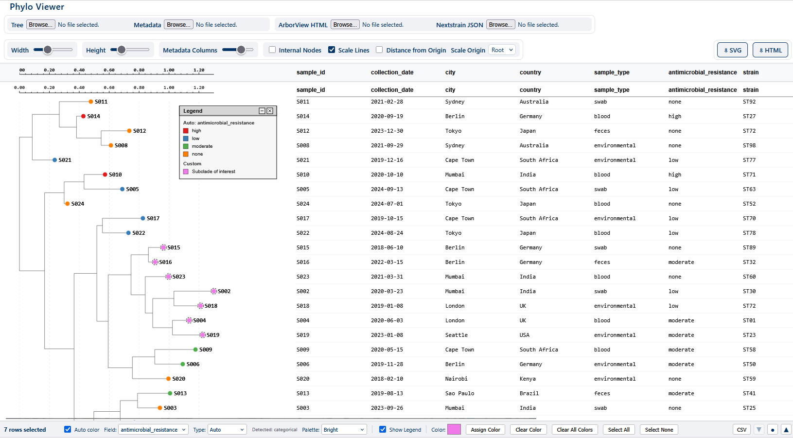

# Phylo

[](https://github.com/dfornika/phylo/actions/workflows/test.yml)

A phylogenetic tree viewer built with ClojureScript and [UIx](https://github.com/pitch-io/uix) (React 19).

Phylo renders Newick-format trees as interactive SVGs with support for metadata overlays from CSV/TSV files. Tree width and vertical spacing are adjustable via slider controls.



## Features

- Load [Newick](https://en.wikipedia.org/wiki/Newick_format) trees and CSV/TSV metadata
- [ArborView](https://github.com/phac-nml/ArborView) HTML import (tree + metadata)
- [Nextstrain](https://nextstrain.org/) JSON import (tree only)
- Adjustable layout (width, height, column spacing)
- Scale bar with optional gridlines and origin toggle (tips/root)
- Internal node distance labels and leaf selection/highlighting
- Auto-color leaves by metadata field (categorical palettes or numeric/date gradients)
- Type override for color-by fields (auto/categorical/numeric/date)
- Export to standalone HTML and SVG

## Prerequisites

- [Clojure CLI](https://clojure.org/guides/install_clojure) (1.11+)
- [Node.js](https://nodejs.org/) (18+)

## Getting Started

```bash
# Install npm dependencies
npm install

# Start the development server (shadow-cljs watch + hot reload)
npm run dev
```

Open [http://localhost:8080](http://localhost:8080) in your browser.

## Project Structure

```
src/
  main/
    app/
      core.cljs               # Thin app shell — mount, init, re-render
      state.cljs              # Shared state atoms, React context, use-app-state hook
      layout.cljs             # LAYOUT constant — spacing, padding, marker sizes
      tree.cljs               # Pure tree layout functions (assign coords, prepare-tree, etc.)
      newick.cljs             # Newick tree format parser
      csv.cljs                # CSV/TSV parser with metadata column support
      color.cljs              # Color palette helpers, gradient/legend builders
      date.cljs               # Date parsing helpers
      scale.cljs              # Scale tick calculation, origin-aware label formatting
      io.cljs                 # Browser file I/O utilities (save-blob!, read-file!)
      util.cljs               # Small shared helpers (client->svg, clamp)
      specs.cljs              # clojure.spec definitions for data structures & props
      components/
        tree.cljs             # Branch, TreeNode, PhylogeneticTree — SVG tree rendering
        metadata.cljs         # StickyHeader, MetadataColumn, MetadataTable
        legend.cljs           # Color legend component for auto-coloring
        toolbar.cljs          # Toolbar — user controls
        viewer.cljs           # TreeContainer, TreeViewer, ScaleGridlines, ScaleBar, PixelGrid
        grid.cljs             # AG-Grid metadata table
        selection_bar.cljs    # Highlight color picker and assign/clear actions
        resizable_panel.cljs  # Draggable bottom panel
      export/
        html.cljs             # Standalone HTML export pipeline
        svg.cljs              # Standalone SVG export helper
      import/
        arborview.cljs        # ArborView HTML import parser
        nextstrain.cljs       # Nextstrain JSON import parser
  test/
    app/
      tree_test.cljs          # Tests for tree layout functions
      newick_test.cljs        # Tests for Newick parser
      csv_test.cljs           # Tests for CSV/TSV parser
      color_test.cljs         # Tests for color palette helpers
      date_test.cljs          # Tests for date parsing
      scale_test.cljs         # Tests for scale tick calculation
      state_test.cljs         # Tests for state export/import round-trip
      specs_test.cljs         # Tests for spec utilities and smoke tests
      generative_test.cljs    # Property-based and stest/check tests
      generators.cljs         # Shared test.check generators
      arborview_import_test.cljs  # Tests for ArborView HTML import
      nextstrain_import_test.cljs # Tests for Nextstrain JSON import
      export_html_test.cljs       # Tests for standalone HTML export
  dev/
    user.clj                  # REPL helper for shadow-cljs
    app/
      dev_preload.cljs        # Dev-only preload: expound + spec instrumentation
      spec_generators.cljs    # Dev-only custom generators for domain specs
```

### Data Flow

```
Newick string
  → newick/newick->map     (parse to tree map)
  → tree/assign-y-coords   (vertical layout)
  → tree/assign-x-coords   (horizontal layout)
  → tree/prepare-tree      (enrich leaves with metadata)
  → PhylogeneticTree       (SVG rendering + metadata overlay)
```

ArborView HTML imports follow the same pipeline after extracting the embedded
Newick string and metadata table.

Auto-coloring derives a per-leaf color map from metadata in the viewer layer and merges it with manual highlights.


## Running Tests

Tests run on Node.js via shadow-cljs `:node-test` target:

```bash
# Single run
npm test

# Watch mode (auto-rerun on changes)
npm run test:watch
```

## Generating API Docs

API documentation is generated by [Codox](https://github.com/weavejester/codox) from function docstrings:

```bash
npm run docs
# or directly:
clojure -X:codox
```

Output is written to `target/doc/`. Open `target/doc/index.html` to browse.

## Available npm Scripts

| Script | Description |
|--------|-------------|
| `npm run dev` | Start shadow-cljs dev server with hot reload |
| `npm run build` | Production release build |
| `npm test` | Compile and run tests (single run) |
| `npm run test:watch` | Run tests in watch mode |
| `npm run docs` | Generate API docs with Codox |

## Docker

A multi-stage Dockerfile builds the app and serves it with nginx:

```bash
docker build -t phylo .
docker run -p 8080:80 phylo
```

A GitHub Actions workflow (`.github/workflows/docker.yml`) automatically builds and pushes the image to GitHub Container Registry on pushes to `main`.

## Architecture

See [doc/01-architecture.md](doc/01-architecture.md) for details on the component hierarchy, data flow, and layout system.

## License

MIT
